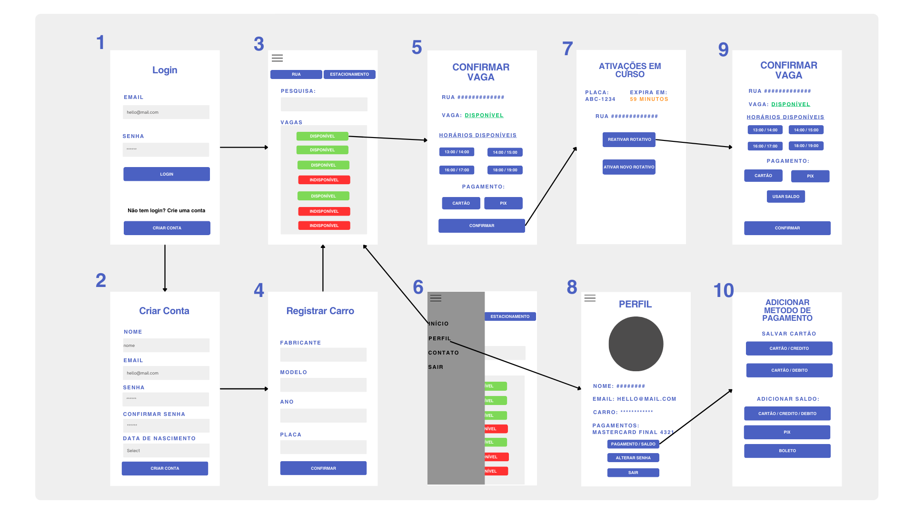

# Informações do Projeto
Rotativos online para vagas de trânsito. 

`Sistemas de Informação` 

## Participantes
 Os membros do grupo são: 
 - Daniel de Oliveira Silva
 - Davi Satler Rodrigues
 - Eduardo Eugenio Pereira
 - João Victor da Silva Oliveira
 - Saulo Luiz de Oliveira e Silva
 - Wherks Junior Souza Lacerda
 - Nycolas Elias Araújo Souza

# Estrutura do Documento

- [Informações do Projeto](#informações-do-projeto)
- [Estrutura do Documento](#estrutura-do-documento)
- [Introdução](#introdução)
- [Problema](#problema)
- [Objetivos](#objetivos) 
- [Justificativa](#justificativa)
- [Público-Alvo](#público-alvo)
- [Especificações do Projeto](#especificações-do-projeto)
- [Personas e Mapas de Empatia](#personas-e-mapas-de-empatia)
- [Histórias de Usuários](#histórias-de-usuários)
- [Requisitos](#requisitos)
- [Requisitos Funcionais](#requisitos-funcionais)
- [Requisitos não Funcionais](#requisitos-não-funcionais)
- [Restrições](#restrições)
- [Projeto de Interface](#projeto-de-interface)
- [User Flow](#user-flow)
- [Wireframes](#wireframes)
- [Metodologia](#metodologia)
- [Divisão de Papéis](#divisão-de-papéis)
- [Ferramentas](#ferramentas)
- [Controle de Versão](#controle-de-versão)
- [Projeto da Solução](#projeto-da-solução)
- [Tecnologias Utilizadas](#tecnologias-utilizadas)
- [Arquitetura da solução](#arquitetura-da-solução)
- [Avaliação da Aplicação](#avaliação-da-aplicação)
- [Plano de Testes](#plano-de-testes)
- [Ferramentas de Testes (Opcional)](#ferramentas-de-testes-opcional)
- [Registros de Testes](#registros-de-testes)
- [Referências](#referências)

# Introdução

## Problema

 Os motoristas de cidades grandes sofrem,devido a falta de locais adequados e o mal gerenciamento dos existentes,  com a ausência de vagas para  o estacionamento de seus veículos. Dessa forma, nota-se que um motorista, ao percorrer a cidade, não tem garantia quanto ao local que poderá estacionar e,muitas vezes, não encontra esse. A partir dessa ideia, nota-se que a ausência de um bom gerênciamento das vagas trás transtornos desnecessários ao motorista e aos  passageiros.

## Objetivos

O objetivo do projeto é o desenvolvimento de uma interface web que forneça ao usuário informações relacionadas a disponibilidade de vagas em estacionamentos rotativos e privados, permitindo a reserva das mesmas. Dessa forma, visamos acabar com as incertezas do usuário em relação a disponibilidade de vagas, além de fornecer aos estacionamentos privados maior número de clientes.

## Justificativa

Sob a perspectiva de que a ausência de uma eficiente gestão resulta em incertezas e atrasos, tendo como consequência um impacto significativo na qualidade de vida dos condutores, o projeto "Rotatividade de Vagas de Trânsito" se apresenta como uma solução que visa aprimorar a administração das vagas de estacionamento viário e,assim, minimizar os transtornos gerados pela escassez das vagas, o que garantirá segurança e praticidade ao motorista.

## Público-Alvo
São cidadãos comuns que frequentemente ou eventualmente precisarão estacionar em lugares movimentados e com difícil acesso a vagas, tornando conveniente a compra e a ativação de tickets de estacionamento na cidade. O aplicativo busca ter todos os motoristas da cidade como público-alvo, pois em algum momento será conveniente para eles utilizar o estacionamento rotativo

# Especificações do Projeto

Foram utilizadas as seguintes linguagens: HTML, CSS e JavaScript. O projeto foi executado e desenvolvido no VSCode. Cada membro ficou responsável por uma funcionalidade específica do projeto.

## Personas e Mapas de Empatia
 - Jéssica Gomez

 - Carlos Roberto

 - Márcio Lira

 - Fantine

 - Cléber Vieira

 - Maria Antônia

 - Marcelo Henrique

## Histórias de Usuários

Carlos vem de fora para passar o feriado na cidade e tem receio de que não haja vagas de carro disponíveis no centro, pois está vindo em época de alta temporada. Usando o aplicativo, ele consegue reservar a vaga sem problemas ao chegar no centro.

Jéssica quer estacionar o carro na vaga rotativa do centro, mas não encontra uma pessoa vendendo os tickets físicos de estacionamento rotativo. Assim, o aplicativo se torna uma excelente solução.

Márcio precisa estacionar todos os dias em um dos pontos comerciais da cidade. Como sua rotina é muito agitada, ele não tem tempo de comprar os tickets de estacionamento rotativo todas as vezes em que estaciona o carro. Com isso, a função de comprar vários tickets antecipadamente pelo aplicativo se torna uma conveniência.

## Requisitos

As tabelas que se seguem apresentam os requisitos funcionais e não funcionais que detalham o escopo do projeto.

### Requisitos Funcionais

|ID    | Descrição do Requisito  | Prioridade |
|------|-----------------------------------------|----|
|RF-001| Realização de login e senha                                       | ALTA |
|RF-002| Criação da conta do usuario                                       | ALTA |
|RF-003| Permitir que o usuário selecione o local de estacionamento        | ALTA | 
|RF-004| Confirmação do local de estacionamento                            | ALTA | 
|RF-005| Ativações em curso                                                | MEDIA | 
|RF-006| Registro de modelo e placa do carro                               | ALTA |
|RF-007| Cadastro de informaçoes de pagamento para cobrança                | ALTA |
|RF-008| Dados do perfil do usuário                                        | MEDIA |

### Requisitos não Funcionais

|ID    | Descrição do Requisito  | 
|------|-----------------------------------------|
|RF-001| • Requisitos de eficiência: o sistema deverá processar n requisições por um determinado tempo.
|RF-002| • Requisitos de portabilidade: o sistema deverá rodar em qualquer plataforma.
|RF-003| • Requisitos éticos: o sistema não apresentará aos usuários quaisquer dados de cunho privativo.
|RF-004| • Requisitos externos: Requisitos decorrentes de fatores externos ao sistema e ao processo de desenvolvimento. Requisitos de interoperabilidade, legislação,localização geográfica etc.
|RF-005| • Requisitos legais: o sistema deverá atender às normas legais, tais como padrões, leis, etc.
|RF-006| • Requisitos de implementação: o sistema deverá ser desenvolvido na linguagem HTML, Java, CSS.

## Restrições

 As restrições se resumem ao projeto ter que ser entregue até o fim do semestre e não poder utilizar um módulo backend

# Projeto de Interface

## User Flow

1. Tela de login, com entrada de dados para usuários que já tenham cadastro.

2. Tela para criação de conta, com entrada de dados para usuários que não possuem conta.

3. Página inicial, onde o usuário pode pesquisar a rua ou o estacionamento desejado, e escolher a vaga disponível.

4. O usuário poderá registrar seu veículo para o estacionar e facilitar a verificação.

5. Confirmação de vaga, o usuário pode conferir se a vaga está certa, escolher um horário para estacionar e a forma de pagamento.

6. Barra lateral, o usuário pode entrar em diferentes telas.

7. Ativações em Curso, onde o usuário pode ver quanto tempo ainda tem naquela vaga, e se quiser, ativar uma nova vaga.

8. Perfil, o usuário poderá adicionar uma foto, alterar dados e adicionar métodos de pagamento.

9. Reativação de vaga, para o usuário reativar a mesma vaga e estender o uso.

10.Métodos de pagamento, o usuário poderá adicionar um cartão ou adicionar saldo na sua conta para facilitar pagamentos futuros.

## Wireframes

......  INCLUA AQUI OS WIREFRAMES DAS TELAS DA APLICAÇÃO COM UM BREVE DESCRITIVO ......

 Wireframes são protótipos das telas da aplicação usados em design de interface para sugerir a
 estrutura de um site web e seu relacionamentos entre suas
 páginas. Um wireframe web é uma ilustração semelhante ao
 layout de elementos fundamentais na interface.
 
# Metodologia

- A metodologia utilizada pelo grupo foi a de delegar funçoes para cada membro a cada etapa em que o projeto
 avançava, todos eram livres para sugerir, modificar e implementar novas funçoes ao projeto, os membros mais experientes do grupo ficaram com as partes mais complexas do projeto; enquanto os mais inexperientes tentavam aprender ficando com as funçoes mais simples porém não menos importantes.
 - Os membros do grupo se comunicaram pelo aplicativo discord e pelo whatsapp em chamas de voz e por trocas de mensagens
 - Utilizamos também o Bootstrap um Framework front-end web para nos ajudar a desenvolver o projeto

## Divisão de Papéis

 - Nycolas Elias e wherks junior ficaram encarregados de formatar e organizar o github juntamente com a equipe
 - Daniel ficou com a parte de login e Cadastro de conta,
 - Saulo ficou com o Cadastro de cartão e as Reservas de vagas(JS)
 - João ficou responsavel pela repaginação da tela incial e por ajustes pendentes em todas as outras áreas do projeto
 - Eduardo foi responsavel pela apresentação

## Ferramentas

| Ambiente  | Plataforma              |Link de Acesso |
|-----------|-------------------------|---------------|
|Editor de código-fonte  | Visual Studio Code |  https://code.visualstudio.com/ | 
|Repositório de código | GitHub | https://github.com/XXXXXXX | 
|Framework front-end | Bootstrap |  https://getbootstrap.com/ | 
|aplicativo de voz sobre IP e comunicação textual.  | Discord | https://discord.com/ | 
 
 As ferramentas empregadas no projeto são:
 
 - Editor de código.
 -  O editor de código foi escolhido porque ele possui uma integração com o
 sistema de versão, pela facil utilizaçao dos participantes. - Ferramentas de comunicação
 -  As ferramentas de comunicação utilizadas possuem  integração semelhante, façil utilizaçao dos participantes do grupo em chamadas de voz ou textual e por isso foram selecionadas.
 - Framework front-end.
 - O Framework front-end foi escolhido pela versatilidade com que podemos utiliza-lo, e pela facilidade em manipulado.
 

## Controle de Versão

----------------------

# Projeto da Solução

## Tecnologias Utilizadas

- Para a criação do projeto foram utilzadas as ferramentas VScode, juntamente com o bootstrap nas seguintes linguagens: Html, Css e Javascript
- A interação do usuário com o aplicativo envolve principalmente o Html e o Javascript, desde o login a confirmação da vaga.
- O Css foi utilizado para a parte estética do site;
- O Html foi responsável pela estrutura do conteúdo na web;
- O Javascript foi nresponsavel pelas funcionalidades;

## Arquitetura da solução

---------------------

# Avaliação da Aplicação

- Não houveram testes globais, apenas individualmente a cerca de cada ferramenta.

## Plano de Testes

- Na medida em que cada ferramenta foi feitas, os testes foram realizados.

## Ferramentas de Testes (Opcional)
 _________
## Registros de Testes

- Cada ferramenta do site foi criada de forma individual entre os membros do grupo, não houveram testes globais, apenas a versão final. Na medida em que cada ferramenta foi feita, os testes foram realizados.

# Referências

- Não tivemos referências no desenvolvimento do trabalho.
